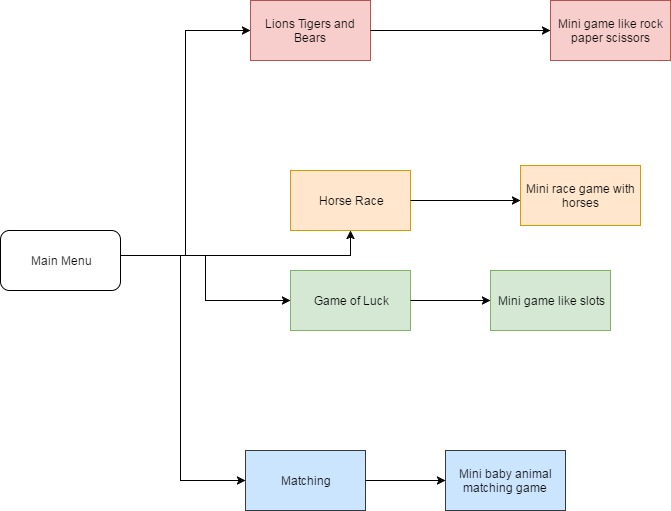

# Final
<h1>Animal Games</h1>

<a href ="www.youtube.com/watch?v=TZ_Y22j0cRQ" >My video is here</a>
<h2>Summary</h2>
The program we created is called Animal Games. There is a total of six forms for our five mini games. Our first game is called Pets Owned, this program asks a series of questions and then averages how many total pets there are between you and your friends! Our second game is a horse race, there are five horses and when you click they race, it keeps score for each horse and you can race as many times as you want. Our third game is called lions, tigers, bears and it is very similar to rock, paper, scissors. There are animal sounds for when whatever animal you pick. Our fourth game is a game of luck, you click a button and the computer randomly generates an animal and sentence about the animal. Our fifth game is a series of questions and you enter your favorite animals. we had a couple problems with learning how to code for sound, and remembering loops and such. 
<h3>Installations</h3> 
You need to install visual studio to access our program, and our program is linked through github.
<h3>Tests</h3>
The main test we ran was just debugging our code. The debugging tells us is our code has any errors because our program cannot function correctly with any errors. Our coding style was the one we were taught in class for visual basic, such as naming buttons "btn". 
<h3>Deployment</h3>
The first thing you do when deploying is run tests to make sure there are no errors in the code. The review the code to make sure it has everything and does what it should. Then branch or auto-deploy the code. After review the code again to make sure no errors occurred in the deployment process. 
<h3>Built With</h3>
Our program was built with visual basic and you used github to share, save, and contribute to the program. 
<h3>Contributing</h3>
We used github to contribute to our program, we merged and share information following githubs code of conduct. 
<a href ="https://www.contributor-covenant.org/version/1/4/code-of-conduct.html" >Code of Conduct here</a>
<h3>Versioning</h3>
We used SemVer for versioning
<h3>Authors</h3>
Bailey Poston
Christine Lewis
<h3>License</h3>
Our project is licensed under the MIT license. This is the basic license used for our class.
<h3>Acknowledgements</h3>
Brosius was our inspiration for this program.
